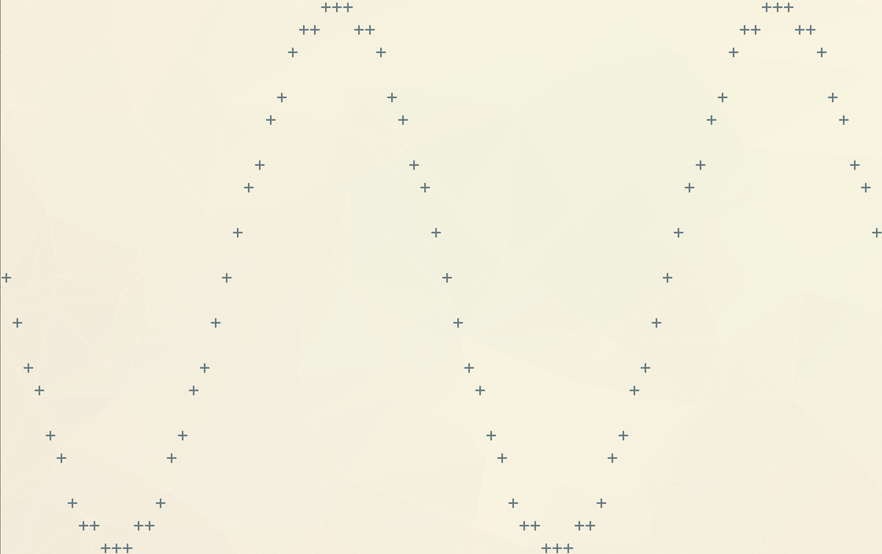

# rust_sin

This program will draw a sin wave to the terminal. Terminal interaction is handled via [termion](https://github.com/redox-os/termion).

The terminal size of 80x24 is currently hard coded. Each terminal cell has width `pi/20` and height `1/12`.
